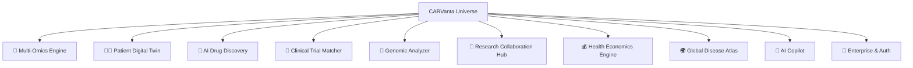

# CARVanta Universe — Expansion Roadmap

Transform CARVanta from a CAR-T scoring tool into the **World's First Open Immunotherapy Intelligence Platform**.

> [!IMPORTANT]
> This roadmap is designed to grow CARVanta to **100K+ lines** across 10 new modules, each solving a real problem that researchers, oncologists, pharma companies, and patients face today.

## The Vision

**CARVanta Universe** = A platform where anyone involved in cancer treatment — from a lab researcher in Mumbai to an oncologist in New York to a patient in Tokyo — can access AI-powered immunotherapy intelligence.

---

## Module 1: 🧬 Multi-Omics Intelligence Engine (~12K lines)

**Problem:** Current CARVanta only scores based on gene expression. Real immunotherapy decisions need proteomics, epigenomics, single-cell RNA, and metabolomics data.

**What it does:**
- Integrates 5 data layers: Transcriptomics, Proteomics, Epigenomics, Metabolomics, Single-cell RNA
- Cross-references Human Protein Atlas, COSMIC, ClinVar, dbSNP
- Computes multi-dimensional target scores weighting all omics layers
- Mutation impact analysis (SNPs, CNVs, fusions affecting target expression)
- Epigenetic stability scoring (is the target consistently expressed or silenced?)

**Backend (~7K lines):**
- `omics/transcriptomics.py` — RNA-seq processing pipeline
- `omics/proteomics.py` — Protein abundance and localization scoring
- `omics/epigenomics.py` — Methylation, histone modification analysis
- `omics/metabolomics.py` — Metabolic pathway impact
- `omics/single_cell.py` — Single-cell heterogeneity analysis
- `omics/integrator.py` — Multi-omics fusion algorithm
- `omics/mutation_analyzer.py` — Variant effect prediction

**Frontend (~5K lines):**
- Multi-omics radar chart (5 axes, one per layer)
- Interactive genome browser (chromosome view with target locations)
- Mutation impact waterfall plot
- Epigenetic stability timeline
- Single-cell expression violin plots

---

## Module 2: 🧑‍⚕️ Patient Digital Twin Simulator (~15K lines)

**Problem:** Oncologists can't predict how a specific patient will respond to CAR-T therapy. They need personalized simulation.

**What it does:**
- Upload patient's genomic profile (VCF/BAM files or manual entry)
- Simulates treatment outcomes for different CAR-T constructs
- Models immune response dynamics over 12 months
- Predicts cytokine release syndrome (CRS) risk
- Estimates tumor regression curves with confidence intervals
- Compares outcomes across different antigen targets for that patient

**Backend (~9K lines):**
- `digital_twin/patient_model.py` — Patient state representation
- `digital_twin/immune_dynamics.py` — T-cell expansion/exhaustion ODEs
- `digital_twin/tumor_model.py` — Tumor growth/regression simulation
- `digital_twin/crs_predictor.py` — Cytokine storm risk model
- `digital_twin/treatment_simulator.py` — Monte Carlo outcome simulation
- `digital_twin/comparator.py` — Multi-target treatment comparison
- `digital_twin/report_generator.py` — Clinical report PDF

**Frontend (~6K lines):**
- Patient profile wizard (step-by-step intake form)
- Real-time treatment simulation with animated tumor shrinkage
- CRS risk gauge with physiological markers
- 12-month outcome timeline with confidence bands
- Side-by-side target comparison dashboard
- Downloadable clinical simulation report

---

## Module 3: 💊 AI-Powered Drug Discovery Engine (~10K lines)

**Problem:** Discovering new CAR-T targets takes years. AI can scan the entire proteome and suggest novel targets in minutes.

**What it does:**
- Scans 20,000+ human proteins for CAR-T target potential
- Uses Graph Neural Networks on protein-protein interaction networks
- Identifies "hidden" targets not yet in clinical trials
- Predicts off-target toxicity before lab validation
- Suggests optimal scFv (antibody fragment) designs
- Generates novel CAR construct architectures

**Backend (~7K lines):**
- `discovery/proteome_scanner.py` — Full proteome surface antigen scan
- `discovery/graph_nn.py` — GNN on STRING protein interaction network
- `discovery/novelty_detector.py` — Identifies unexplored targets
- `discovery/toxicity_predictor.py` — Off-target tissue expression analysis
- `discovery/scfv_designer.py` — Antibody fragment optimization
- `discovery/car_architect.py` — CAR construct design suggestions

**Frontend (~3K lines):**
- Proteome heatmap (20K proteins, filterable)
- Novel target cards with evidence levels
- Toxicity risk matrix
- CAR construct designer (drag-and-drop domains)

---

## Module 4: 🏥 Clinical Trial Matcher (~8K lines)

**Problem:** Patients can't find relevant clinical trials. Oncologists waste hours searching ClinicalTrials.gov manually.

**What it does:**
- Real-time sync with ClinicalTrials.gov API (400K+ trials)
- AI-powered patient-to-trial matching based on genomic profile
- Geographic proximity matching (find trials near the patient)
- Eligibility pre-screening (checks inclusion/exclusion criteria automatically)
- Trial outcome predictions based on historical data
- Automated trial enrollment assistance

**Backend (~5K lines):**
- `trials/clinicaltrials_sync.py` — ClinicalTrials.gov API integration
- `trials/matcher.py` — NLP-based patient-trial matching
- `trials/eligibility_checker.py` — Automated criteria checking
- `trials/geo_proximity.py` — Geographic distance calculator
- `trials/outcome_predictor.py` — Historical outcome analysis

**Frontend (~3K lines):**
- Trial search with map view (pins showing trial locations)
- Patient-trial match score cards
- Eligibility checklist (auto-filled from patient profile)
- Trial timeline viewer
- One-click enrollment inquiry

---

## Module 5: 🧪 Real-Time Genomic Analyzer (~12K lines)

**Problem:** Researchers generate sequencing data but lack tools to instantly analyze it for immunotherapy relevance.

**What it does:**
- Upload FASTQ/BAM/VCF files directly
- Real-time variant calling and annotation
- Neoantigen prediction (mutant peptides that could be CAR-T targets)
- HLA typing and peptide-MHC binding prediction
- Tumor mutational burden (TMB) calculation
- Microsatellite instability (MSI) detection
- Generates publication-ready figures

**Backend (~8K lines):**
- `genomics/file_processor.py` — FASTQ/BAM/VCF parser
- `genomics/variant_caller.py` — SNV/indel detection
- `genomics/neoantigen_predictor.py` — MHC binding prediction
- `genomics/hla_typer.py` — HLA allele determination
- `genomics/tmb_calculator.py` — Tumor mutational burden
- `genomics/msi_detector.py` — Microsatellite instability
- `genomics/figure_generator.py` — Publication-quality plots

**Frontend (~4K lines):**
- File upload with drag-and-drop and progress bar
- Variant browser (filterable table with functional annotations)
- Neoantigen ranking dashboard
- Circos plot for genomic overview
- TMB/MSI gauge with clinical interpretation

---

## Module 6: 👥 Research Collaboration Hub (~10K lines)

**Problem:** Cancer research is siloed. Labs duplicate work because there's no shared platform for immunotherapy research.

**What it does:**
- GitHub-like collaboration for biotech research
- Shared experiments, datasets, and analysis notebooks
- Real-time collaborative analysis sessions
- Peer review system for community-submitted targets
- Research paper integration (auto-link to PubMed)
- Lab-to-lab messaging and discussion forums

**Backend (~6K lines):**
- `collab/projects.py` — Research project management
- `collab/experiments.py` — Shared experiment tracking
- `collab/notebooks.py` — Jupyter-like notebook system
- `collab/peer_review.py` — Target review workflow
- `collab/pubmed_linker.py` — PubMed API integration
- `collab/messaging.py` — WebSocket-based messaging

**Frontend (~4K lines):**
- Project dashboard with activity feed
- Shared notebook editor with real-time collaboration
- Peer review interface with voting
- Research paper sidebar (contextual PubMed results)
- Team management and permissions

---

## Module 7: 💰 Health Economics Engine (~8K lines)

**Problem:** CAR-T therapy costs $400K-$500K per patient. Hospitals need tools to evaluate cost-effectiveness.

**What it does:**
- Cost-effectiveness analysis (CEA) for different CAR-T targets
- Quality-Adjusted Life Years (QALY) calculator
- Budget impact modeling for healthcare systems
- Insurance reimbursement pathway analysis
- Manufacturing cost estimator (viral vector, cell processing)
- Market size estimation for novel targets

**Backend (~5K lines):**
- `economics/cea_model.py` — Cost-effectiveness analysis
- `economics/qaly_calculator.py` — QALY computation
- `economics/budget_impact.py` — Healthcare system budget modeling
- `economics/manufacturing_cost.py` — Production cost estimator
- `economics/market_analyzer.py` — TAM/SAM/SOM estimation

**Frontend (~3K lines):**
- Cost-effectiveness plane (scatter plot with ICER threshold)
- QALY comparison bar charts
- Budget impact waterfall diagram
- Manufacturing cost breakdown treemap
- Market opportunity dashboard

---

## Module 8: 🌍 Global Disease Atlas (~10K lines)

**Problem:** Cancer burdens differ dramatically by region. No platform connects immunotherapy potential to geographic disease data.

**What it does:**
- Interactive world map showing cancer incidence by type and region
- Antigen expression prevalence by population/ethnicity
- Treatment access gaps (where CAR-T could have most impact)
- Epidemiological trend analysis (rising/falling cancer types)
- Regulatory landscape by country
- Multi-language support (20+ languages)

**Backend (~6K lines):**
- `atlas/incidence_data.py` — WHO/GLOBOCAN cancer incidence data
- `atlas/prevalence_analyzer.py` — Antigen prevalence by population
- `atlas/access_gaps.py` — Treatment access inequality analysis
- `atlas/trends.py` — Epidemiological trend modeling
- `atlas/regulatory_map.py` — Country-by-country regulatory data
- `atlas/i18n.py` — Internationalization system

**Frontend (~4K lines):**
- Interactive choropleth world map (cancer burden heatmap)
- Regional disease profile cards
- Treatment access gap visualizations
- Trend timelines with projections
- Language switcher (auto-detect browser locale)

---

## Module 9: 🤖 AI Research Copilot (~10K lines)

**Problem:** Researchers spend hours reading papers and interpreting data. They need an AI assistant that understands immunotherapy.

**What it does:**
- Natural language chat interface for research questions
- RAG (Retrieval-Augmented Generation) over 50K+ immunotherapy papers
- Auto-generates literature reviews for any antigen
- Suggests experimental designs based on research goals
- Explains complex results in plain language
- Voice-enabled for hands-free lab use

**Backend (~7K lines):**
- `copilot/rag_engine.py` — Vector database + retrieval
- `copilot/paper_index.py` — PubMed paper indexer
- `copilot/chat_handler.py` — Conversational AI controller
- `copilot/lit_reviewer.py` — Auto literature review generator
- `copilot/experiment_designer.py` — Protocol suggestion engine
- `copilot/voice_handler.py` — Speech-to-text/text-to-speech

**Frontend (~3K lines):**
- Chat interface with markdown rendering
- Cited answer cards (linked to source papers)
- Literature review document viewer
- Experiment protocol generator form
- Voice input/output toggle

---

## Module 10: 🔐 Enterprise Platform & Auth (~8K lines)

**Problem:** Without auth, databases, and enterprise features, no hospital or pharma company will adopt the platform.

**What it does:**
- User authentication (OAuth2, SSO, MFA)
- Role-based access control (Researcher, Clinician, Admin, Patient)
- PostgreSQL database replacing in-memory data
- Full audit trail with tamper-proof logging
- HIPAA/GDPR compliance enforcement
- API rate limiting and usage analytics
- Billing and subscription management
- Multi-tenant architecture

**Backend (~5K lines):**
- `auth/oauth.py` — OAuth2 + SSO integration
- `auth/rbac.py` — Role-based access control
- `auth/mfa.py` — Multi-factor authentication
- [db/models.py](file:///C:/Users/dhruv/CARVanta/db/models.py) — SQLAlchemy ORM models
- `db/migrations/` — Alembic migration scripts
- `billing/subscriptions.py` — Stripe integration
- `compliance/gdpr.py` — Data privacy enforcement

**Frontend (~3K lines):**
- Login/register pages with SSO buttons
- User profile and settings
- Admin dashboard (user management, analytics)
- Billing page with plan comparison
- Data export/deletion (GDPR compliance)

---

## Module 11: 🧠 Neural Network Bridge (~10K lines)

**Problem:** Researchers can't visualize how antigens, diseases, pathways, and omics layers interconnect. They need an interactive knowledge graph to discover hidden relationships.

**What it does:**
- Interactive force-directed graph visualization of 119K+ antigens
- Nodes represent genes, diseases, pathways, drugs, cell types
- Edges encode relationships: co-expression, pathway membership, drug targets, clinical trials
- Color-coded clusters by omics layer (transcriptomics, proteomics, epigenomics, etc.)
- Real-time filtering by CVS score, expression level, pathway, disease type
- Click any node to expand its neighborhood and see connected entities
- Physics-based layout — nodes repel, connections attract, clusters self-organize
- Export graph snapshots as publication-ready figures
- Search and highlight any gene/pathway/disease in the network

**Backend (~5K lines):**
- `neural_bridge/graph_builder.py` — Constructs the antigen-pathway-disease knowledge graph
- `neural_bridge/graph_api.py` — REST API serving graph data (nodes, edges, metadata)
- `neural_bridge/cluster_engine.py` — Community detection and cluster assignment
- `neural_bridge/search_engine.py` — Full-text search across graph entities
- `neural_bridge/export.py` — Graph snapshot and data export

**Frontend (~5K lines):**
- Interactive 3D/2D force-directed graph using `react-force-graph`
- Node tooltips with gene info, CVS score, expression data
- Cluster legend panel with color-coded pathway groups
- Filter sidebar (by score, pathway, disease, omics layer)
- Minimap for navigating large graphs
- Search bar with autocomplete
- Graph controls (zoom, pan, physics toggle, layout modes)
- Export button (PNG, SVG, JSON)

---

## Line Count Summary

| Module | Backend | Frontend | Total |
|--------|---------|----------|-------|
| Current v5 | ~5K | ~9K | ~14K |
| Multi-Omics Engine | 7K | 5K | 12K |
| Patient Digital Twin | 9K | 6K | 15K |
| AI Drug Discovery | 7K | 3K | 10K |
| Clinical Trial Matcher | 5K | 3K | 8K |
| Genomic Analyzer | 8K | 4K | 12K |
| Collaboration Hub | 6K | 4K | 10K |
| Health Economics | 5K | 3K | 8K |
| Global Disease Atlas | 6K | 4K | 10K |
| AI Research Copilot | 7K | 3K | 10K |
| Enterprise & Auth | 5K | 3K | 8K |
| Neural Network Bridge | 5K | 5K | 10K |
| **Total** | **75K** | **52K** | **127K** |

---

## Recommended Build Order

1. **Enterprise & Auth** (Module 10) — Foundation for everything else
2. **Multi-Omics Engine** (Module 1) — Core scientific upgrade
3. **Patient Digital Twin** (Module 2) — Most impressive feature
4. **AI Research Copilot** (Module 9) — Everyone can use this
5. **Clinical Trial Matcher** (Module 4) — Immediate patient impact
6. **Neural Network Bridge** (Module 11) — Visual intelligence layer
7. **Genomic Analyzer** (Module 5) — Researcher magnet
8. **AI Drug Discovery** (Module 3) — Pharma companies will pay for this
9. **Global Disease Atlas** (Module 8) — Global reach
10. **Collaboration Hub** (Module 6) — Community growth
11. **Health Economics** (Module 7) — Enterprise sales

## Verification Plan

Each module will be verified via:
- Unit tests (pytest) for all backend functions
- Integration tests for API endpoints
- Browser-based UI testing
- Performance benchmarks (response time < 2s)
